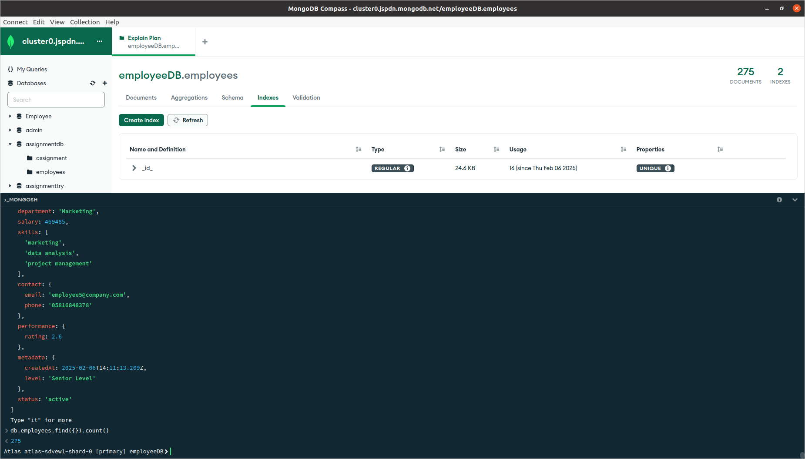
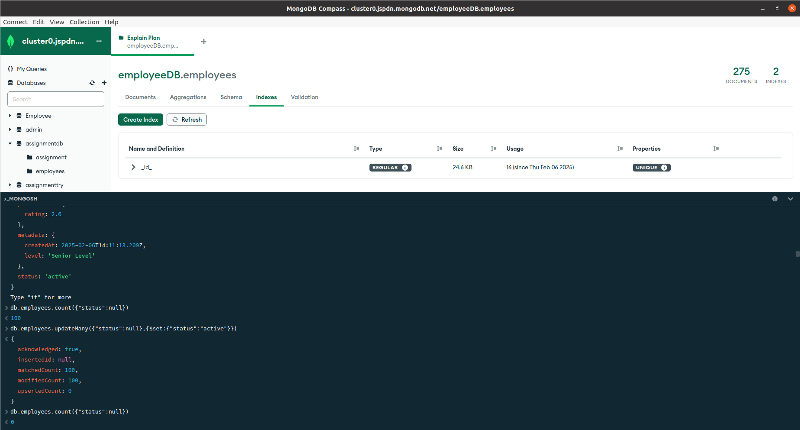
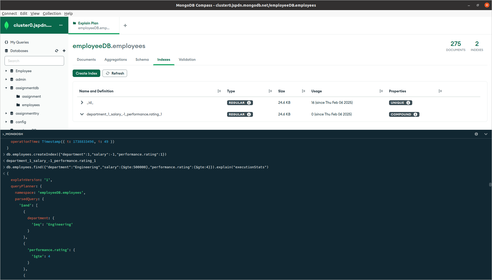
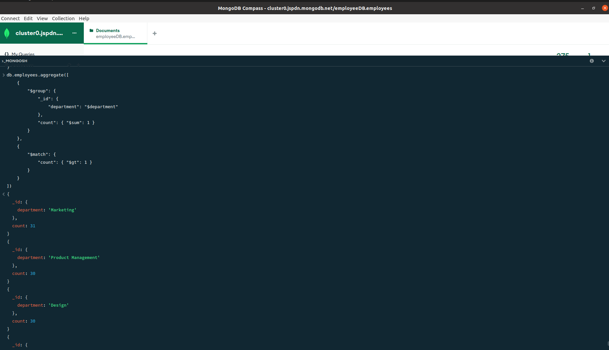
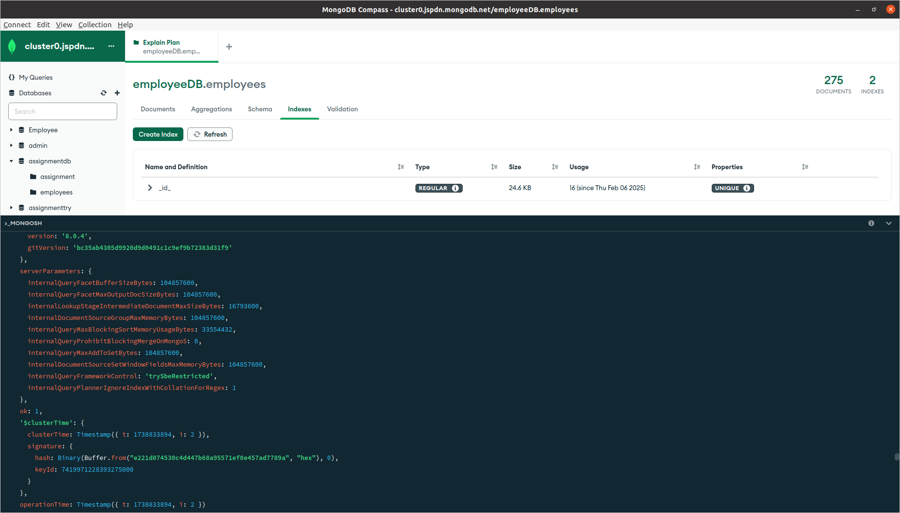

# MongoDB Assignment


### 1. Batch Create with minimum 100 records in MongoDb (create batch).

#### Code (Q1):

```python
from pymongo import MongoClient
import random
from datetime import datetime
import faker
from pymongo.errors import PyMongoError

class EmployeeDataGenerator:
    def __init__(self):
        self.client = MongoClient('mongodb+srv://hiteshjethava:<db_password>@cluster0.jspdn.mongodb.net/')
        self.db = self.client['employeeDB']
        self.collection = self.db['employees']

        self.fake = faker.Faker('en_IN')
        self.departments = ['Sales', 'Marketing', 'Engineering', 'HR', 'Finance']
        self.skills = ['communication', 'leadership', 'problem-solving', 'teamwork', 'coding']

    def generate_employee(self, index):
        levels = ['Entry Level', 'Mid Level', 'Senior Level', 'Executive Level']
        salary_ranges = {'Entry Level': (50000, 100000), 'Mid Level': (100000, 250000), 'Senior Level': (250000, 500000), 'Executive Level': (500000, 1000000)}

        employee_doc = {
            'employeeId': f'EMP-{str(index + 1).zfill(3)}',
            'name': self.fake.name(),
            'department': self.departments[index % len(self.departments)],
            'salary': random.randint(*salary_ranges[levels[index % len(levels)]]),
            'skills': random.sample(self.skills, 3),
            'contact': {'email': f'employee{index}@company.com', 'phone': self.fake.phone_number()},
            'performance': {'rating': round(random.uniform(1, 5), 2)},
            'metadata': {'createdAt': datetime.now(), 'level': levels[index % len(levels)]},
            'status': 'active' if index % 2 == 0 else 'inactive'
        }
        return employee_doc

    def insert_employees_batch(self, count=275, batch_size=50):
        self.collection.delete_many({})
        employees = [self.generate_employee(i) for i in range(count)]

        for i in range(0, len(employees), batch_size):
            batch = employees[i:i + batch_size]
            try:
                result = self.collection.insert_many(batch)
                print(f"Inserted batch starting from index {i}")
            except Exception as e:
                print(f"Error in batch starting from index {i}: {e}")

def main():
    generator = EmployeeDataGenerator()
    generator.insert_employees_batch(count=275)

if __name__ == "__main__":
    main()
```


### 2. Batch Update with minimum 100 records  in MongoDB (update batch).

#### Code (Q2):


```javascript
db.employees.updateMany({"status": null}, {$set: {"status": "active"}})
```


### 3. Perform indexing on particular 3 fields in MongoDB.
#### Code (Q3):

Create an index on the `department`, `salary`, and `performance.rating` fields.

```javascript
db.employees.createIndex({"department": 1, "salary": -1, "performance.rating": 1})
```


### 4. Find duplicates using aggregation in MongoDB

#### Code (Q4):

```javascript
db.employees.aggregate([
    { 
        "$group": { 
            "_id": {"department": "$department"},
            "count": { "$sum": 1 }
        } 
    },
    { 
        "$match": { 
            "count": { "$gt": 1 } 
        } 
    }
])
```



---
